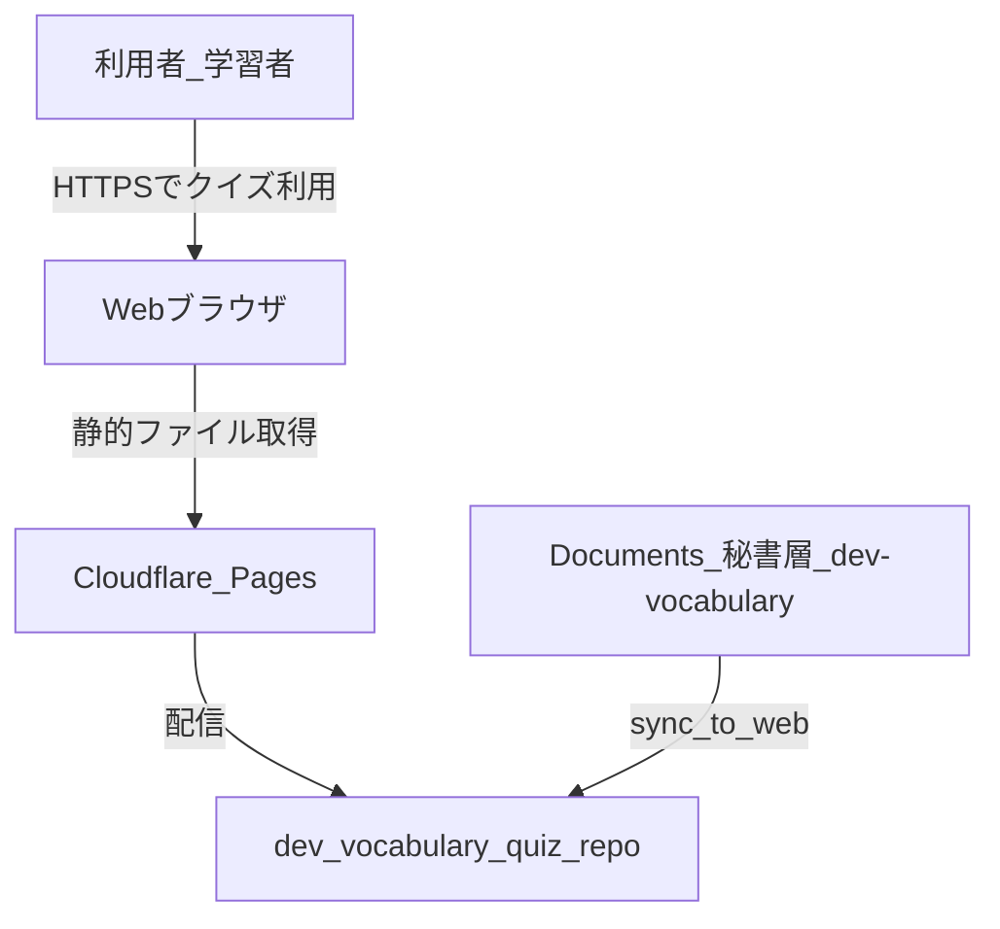
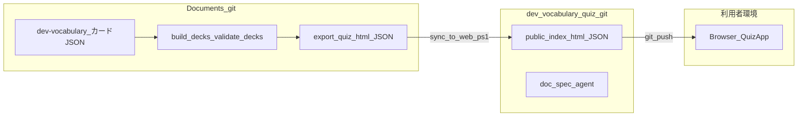
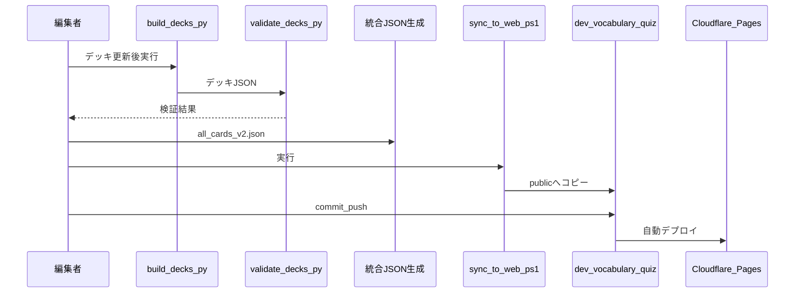

# 開発語彙 4 択クイズ — アーキテクチャ

| 項目 | 内容 |
|---|---|
| プロジェクト | `dev_vocabulary_quiz` |
| 版 | v1.0 |
| 作成日 | 2026-09-06 |
| ステータス | 合意用 |
| 関連 | [企画書.md](企画書.md) · [要件定義書.md](要件定義書.md) · [CLOUDFLARE_DEPLOY.md](../../CLOUDFLARE_DEPLOY.md) |

---

## 1. 位置づけ

本書はシステムの **コンテキスト・コンテナ・デプロイ・同期・セキュリティ境界** を定義する。画面・ロジックの詳細は [設計書_基礎.md](設計書_基礎.md) / [設計書_詳細.md](設計書_詳細.md) を参照。

---

## 2. コンテキスト図（C4 Level 1）



| 関係者／システム | 説明 |
|---|---|
| 利用者 | スマホ・PC から URL アクセス。認証なし |
| ブラウザ | HTML/JSON を取得しクライアント完結で採点 |
| Cloudflare Pages | `public/` を静的配信（ビルドなし） |
| dev_vocabulary_quiz | 公開 UI・統合 JSON・プロジェクト doc |
| Documents 秘書層 | カード正本・ビルド・export |

---

## 3. コンテナ図（C4 Level 2）



| コンテナ | 技術 | 責務 |
|---|---|---|
| dev-vocabulary | Python, JSON | カード正本・デッキビルド・検証 |
| export | HTML, JSON | クイズ UI・統合 JSON の生成物（正本は Documents 側） |
| `public/` | HTML, JSON | 公開用コピー（Cloudflare 出力ルート） |
| Browser QuizApp | vanilla JS | 出題・採点・解説（NFR-02, NFR-03） |

---

## 4. デプロイビュー

| 項目 | 値 |
|---|---|
| ホスティング | Cloudflare Pages |
| ビルドコマンド | （空） |
| 出力ディレクトリ | `public` |
| 配信物 | `index.html`, `all_cards_v2.json` |

手順: [CLOUDFLARE_DEPLOY.md](../../CLOUDFLARE_DEPLOY.md)

**NFR-32**: npm・バンドラ・SSR なし。git push で自動デプロイ。

---

## 5. データ同期シーケンス



| ステップ | 実行場所 | 成果物 |
|---|---|---|
| 1 | Documents | デッキ JSON |
| 2 | Documents | `validate_decks.py` パス |
| 3 | Documents（要整備） | `all_cards_v2.json`（id ユニーク） |
| 4 | Documents | `sync_to_web.ps1` → `public/` |
| 5 | dev_vocabulary_quiz | git push → Pages |

---

## 6. ランタイムビュー

### 6.1 初回アクセス

```text
GET /index.html
GET /all_cards_v2.json
  → fetch 成功 → startQuiz(cards)
  → メモリ内状態のみ（セッション永続なし）
```

### 6.2 オフライン継続（NFR-02）

| 段階 | 動作 |
|---|---|
| 初回 online | HTML + JSON をブラウザキャッシュまたはメモリに保持 |
| 以降 offline | 既に `allCards` がロード済みなら出題・採点・次問は可能 |
| 初回 offline | fetch 失敗 → Setup 画面でファイル選択（FR-31） |

**明示**: Service Worker / PWA は v1.0 スコープ外。オフラインは「一度読み込み後の同一タブ内」が前提。

### 6.3 file:// プロトコル

`fetch("./all_cards_v2.json")` は CORS 制約で失敗しうる。ファイル選択で代替（設計書_詳細 §9）。

---

## 7. リポジトリ境界

| リポジトリ | 管理対象 | git |
|---|---|---|
| Documents | `doc/life/career/dev-vocabulary/`、秘書層 | Documents ローカル git |
| dev_vocabulary_quiz | `public/`, `doc/`, `.cursor/` | 独立 git（公開 GitHub 連携可） |

**公開 GitHub 境界**: `.cursor/`, `doc/ai/`, `AGENTS.md` は公開リポジトリに含めない — [public-github-boundary.md](../agent/public-github-boundary.md)

---

## 8. セキュリティ境界

| 要件 | 対策 |
|---|---|
| NFR-30 | `public/` に秘密情報・個人情報を置かない |
| NFR-31 | DOM 更新は `textContent` / `createElement` 優先 |
| 認証 | なし（全世界公開） |
| サーバ | なし（攻撃面は静的ファイルのみ） |

検証: `python scripts/check_no_sensitive_patterns.py`

詳細: [security-and-privacy.md](../agent/security-and-privacy.md)

---

## 9. 技術選定

| 採用 | 理由 |
|---|---|
| HTML + CSS + vanilla JS | 軽量（NFR-01）、ビルド不要、学習コスト低 |
| JSON 同梱 | オフライン継続・決定的採点 |
| Cloudflare Pages | 無料枠・git 連携・`public` 直出力 |

| 非採用（v1.0） | 理由 |
|---|---|
| npm / Vite / React | 要件定義書 §10.2・配信軽量化 |
| サーバ API | スコープ外 |
| LLM 採点 | G4・採点確実性 |

---

## 10. 将来拡張の差し込み口

| 拡張 | 差し込み位置 | 要件 |
|---|---|---|
| localStorage 学習記録 | QuizApp 状態 + Scoring 後 | FR-F1 |
| SRS 出題 | PoolManager | FR-F2 |
| PWA / Service Worker | アーキ追加・`public/sw.js` | スコープ外 |
| 英→日 | QuestionEngine + ChoiceBuilder | FR-04, FR-05 |
| 統合 JSON 検証 | CI / pre-deploy スクリプト | CR-30, CR-31 |

---

## 変更履歴

### 2026-09-06 — 初版

- **理由**: 企画書 §4 を独立正本化。C4・同期・ランタイムを整理
- **操作**: 新規作成
