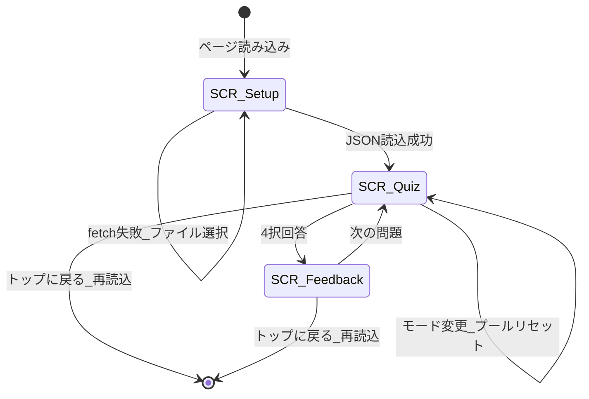

# 開発語彙 4 択クイズ — 基礎設計書

| 項目 | 内容 |
|---|---|
| プロジェクト | `dev_vocabulary_quiz` |
| 版 | v1.0 |
| 作成日 | 2026-09-06 |
| ステータス | 合意用 |
| 関連 | [要件定義書.md](要件定義書.md) · [設計書_詳細.md](設計書_詳細.md) · [DESIGN.md](../../DESIGN.md) |

---

## 1. 位置づけ

### 1.1 目的

本書は [要件定義書.md](要件定義書.md) の機能・非機能要件を、**利用者が体験する画面と操作**の単位で構造化する。アルゴリズム・DOM・データ参照の詳細は [設計書_詳細.md](設計書_詳細.md) に委譲する。

### 1.2 文書間の関係

| 文書 | 役割 |
|---|---|
| [要件定義書.md](要件定義書.md) | 何を満たすか（FR / NFR / CR） |
| **本書（基礎設計）** | 画面・遷移・UX 原則・学習モード |
| [設計書_詳細.md](設計書_詳細.md) | ロジック・状態・データマッピング |
| [アーキテクチャ.md](アーキテクチャ.md) | 配信・リポジトリ・同期 |
| [テスト設計書.md](テスト設計書.md) | 要件検証・テストケース |
| [DESIGN.md](../../DESIGN.md) | 色・タイポ・コンポーネントのビジュアル正本 |

---

## 2. システム概要

ブラウザ上で動作する **静的 4 択クイズ**。サーバ不要で採点・解説表示まで完結する。

| 目的 ID | 要件定義の目的 | 基礎設計での実現 |
|---|---|---|
| G1 | 二重の意味の定着 | 問題文で日常＋プロ意味を提示、解説で再確認 |
| G2 | 文脈での記憶 | 解説パネルで英例文・コード例・使われ方を表示 |
| G3 | 手軽な継続 | 1 ページ・軽量配信・スマホ 1 カラム UI |
| G4 | 採点の確実性 | クライアント側の index 比較（LLM 不使用） |

---

## 3. 画面一覧と要件対応

| 画面 ID | 名称 | DOM ルート | 主要要素 | 対応要件 |
|---|---|---|---|---|
| SCR-Setup | 読み込み／エラー | `#setup` | 読み込みヒント、JSON ファイル選択 | FR-30, FR-31, NFR-04 |
| SCR-Quiz | 出題 | `#quiz` / `#question-panel` | モードバー、統計、問題文、4 択 | FR-01〜03, FR-06, FR-20, FR-22, NFR-10〜11 |
| SCR-Feedback | 解説 | `#feedback-panel` | 正誤、解説 DL、次の問題 | FR-11〜14, FR-23, CR-20, NFR-20 |
| SCR-Quiz-EN2JA | 英→日出題（目標） | `#question-panel`（拡張） | `term` 提示、日本語意味 4 択 | FR-04, FR-05（**未実装**） |

**共通ヘッダ**: `#top-link`（トップに戻る）— FR-21。クイズ開始後に表示。

---

## 4. 画面遷移

### 4.1 遷移時の振る舞い

| 操作 | 画面変化 | 状態リセット |
|---|---|---|
| JSON 読込成功 | Setup 非表示 → Quiz 表示 | `usedIds` クリア、問題番号 0 |
| 4 択回答 | Question 非表示 → Feedback 表示 | `usedIds` に当該カード追加 |
| 次の問題 | Feedback 非表示 → Question 表示 | 新ランダム出題 |
| モード変更 | Quiz 継続 | `usedIds`・問題番号リセット |
| トップに戻る | ページ再読み込み | 全状態初期化 |

---

## 5. 出題形式

### 5.1 現行（日→英 / ja2en）

| 項目 | 内容 |
|---|---|
| 問題文 | 「次の説明に合う英単語はどれ？」＋日常の意味＋プログラミングでの意味（日本語） |
| 選択肢 | 英単語（`term`）4 つ |
| 正解 | 出題カードの `term` |
| 対応要件 | FR-03 |

### 5.2 目標（英→日 / en2ja）— 未実装

| 項目 | 内容 |
|---|---|
| 問題文 | 英単語（`term`）を大きく表示。「この単語の意味として正しいのはどれ？」 |
| 選択肢 | 日本語の意味文 4 つ |
| 正解 | `meaning_general_ja` または `meaning_programming_ja` のいずれか（出題時にランダム決定） |
| 誤答 | 同プール内の他カードから同種（日常 or プロ）の意味を抽出 |
| 対応要件 | FR-04 |

### 5.3 出題方向の切替（FR-05）— 未実装

**採用案**: モードバー（`#modes`）の直下に **出題方向バー**（`#direction-bar`）を追加。

| UI 要素 | `data-direction` | 動作 |
|---|---|---|
| 日→英 | `ja2en` | 常に §5.1 の形式 |
| 英→日 | `en2ja` | 常に §5.2 の形式 |
| ミックス | `mixed` | 各問題で `ja2en` / `en2ja` をランダム選択 |

切替時は `usedIds` と問題番号をリセット（モード変更と同様）。

**非採用案（参考）**: 設定画面での切替（画面が増え移動中の操作が増える）、問題ごとの手動切替（毎回の認知負荷が高い）。

---

## 6. 学習モード定義

出題プールは `all_cards_v2.json` を `type` / `tier` でフィルタする。

| モード key | UI ラベル | フィルタ条件 | 語数（目安） |
|---|---|---|---|
| `basic` | 基本の動詞・名詞 | `type === "identifier"` かつ `tier === "P0"` | 77 |
| `anti` | 単体の汎用名 | `type === "anti_pattern"` | 13 |
| `lib` | ライブラリ・API | `type` が `method` / `package` / `stdlib` | 65 |

**未カバー（将来 FR-F4）**: `identifier`+`P2`、`pattern`+`P0`、`identifier`+`DS` 等（110 語）。

---

## 7. UX 原則（非機能の画面への翻訳）

| 要件 ID | 原則 | 画面での具体化 |
|---|---|---|
| NFR-10 | スマホで見やすい | `max-width: 640px`、1 カラム、本文 `≥1rem`、行間 `≥1.6` |
| NFR-11 | 直感的なボタン配置 | 4 択は縦 `grid`、全幅タップ、主要 CTA は下部全幅 |
| NFR-12 | 視認性 | 問題ラベル・意味ブロック・選択肢でサイズ・ウェイト差 |
| NFR-13 | 余計な文言なし | Gem 言及等の内部経緯は非表示 |
| NFR-20 | 色弱フレンドリー | 正誤に **【結果】正解！／不正解（正解は X）** の文言を必須。色は補助 |
| NFR-21 | コントラスト | `--text` / `--muted` / 背景の差を DESIGN.md と整合 |
| NFR-22 | フォーカス表示 | ボタンに `:focus-visible` アウトライン（詳細設計・DESIGN.md で定義） |

### 7.1 タップ領域

選択肢ボタン・モードボタンは **最小 44×44 CSS px 相当**（padding 込み）を目安とする。

---

## 8. コンテンツの表示タイミング（利用者視点）

| コンテンツ | 出題画面 | 解説パネル | コンテンツ要件 |
|---|---|---|---|
| 日常の意味 | 表示（ja2en） | 再表示 | FR-11 |
| プログラミングでの意味 | 表示（ja2en） | 再表示 | FR-11 |
| 英単語（term） | 選択肢（ja2en）／問題文（en2ja・目標） | 強調表示 | FR-04 |
| コードもしくはプログラミングでの使われ方 | — | 表示（**CR-20 文言**） | CR-20 |
| 日常英語の例文（最大 2 件） | — | 表示 | FR-12, CR-01〜04 |
| コードでの例（1 件＋解説） | — | 表示 | FR-13, CR-10〜12 |

解説は **回答後のみ** 表示し、出題中の情報量を抑える（認知負荷の低減）。

---

## 9. 要件トレーサビリティ（基礎設計）

| 要件 ID | 本書での扱い |
|---|---|
| FR-01〜06 | §4〜§6, §5 |
| FR-04, FR-05 | §5.2, §5.3（目標） |
| FR-10〜14 | §8 |
| FR-20〜23 | §3, §4 |
| FR-30, FR-31 | §3 SCR-Setup |
| NFR-10〜13, NFR-20〜22 | §7 |
| CR-20〜22 | §8 |

詳細なテスト対応は [テスト設計書.md](テスト設計書.md) の RTM を参照。

---

## 変更履歴

### 2026-09-06 — 初版

- **理由**: 要件定義書に基づく基礎設計の正本化。企画書 §3.3 から画面・UX を移管
- **操作**: 新規作成
